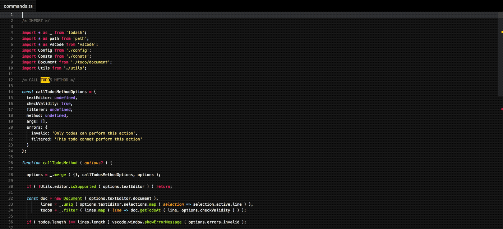
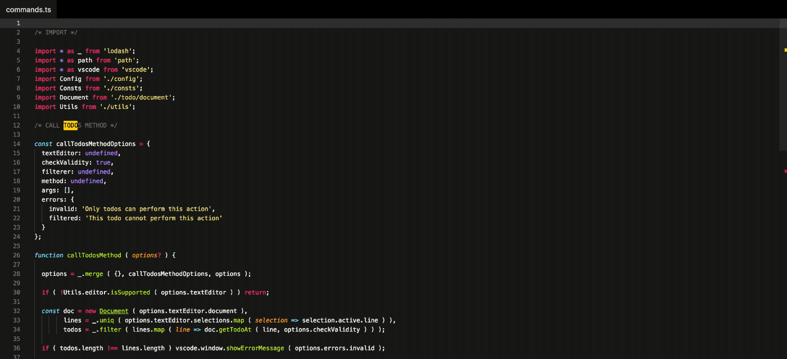

# Git File History

<p align="center">
	
</p>

View or diff against previous versions of the current file.

There are at least a couple of other extensions that provide these functionalities, but they are so bloated with features I don't need that I couldn't even make them work.

## Install

Follow the instructions in the [Marketplace](https://marketplace.visualstudio.com/items?itemName=fabiospampinato.vscode-git-history), or run the following in the command palette:

```shell
ext install fabiospampinato.vscode-git-history
```

## Usage

It adds 4 commands to the command palette:

```js
'Git: Open File at Commit' // Open the current file at particular commit in time
'Git: Open File at Commit to the Side' // Open the current file, to the side, at particular commit in time
'Git: Diff File at Commit' // View the changes made to the current file in a particular commit in time
'Git: Diff File at Commit against Current' // View the changes made to the current file between now and a particular commit in time
```

## Settings

```js
{
  "gitHistory.details.author.enabled": true, // Show the name of the commit's author
  "gitHistory.details.date.enabled": true, // Show the date of the commit
  "gitHistory.details.date.format": "YYYY-MM-DD HH:mm", // Format used for displaying the date
  "gitHistory.details.hash.enabled": false, // Show the hash of the commit
  "gitHistory.details.hash.length": 7 // Show only this number of characters from the end of the hash
}
```

Dates are formatted using [moment](https://momentjs.com/docs/#/displaying/format/).

## Demo

### Open a previous version to the side



### Diff against a previous version



## Hints

- **Diff against opened files**: sometimes diffing against a previous version of a file is not enough, try [Diff](https://marketplace.visualstudio.com/items?itemName=fabiospampinato.vscode-diff) for diffing against any arbitrary open file you have.

## Contributing

If you found a problem, or have a feature request, please open an [issue](https://github.com/fabiospampinato/vscode-git-history/issues) about it.

If you want to make a pull request you can debug the extension using [Debug Launcher](https://marketplace.visualstudio.com/items?itemName=fabiospampinato.vscode-debug-launcher).

## License

MIT © Fabio Spampinato
